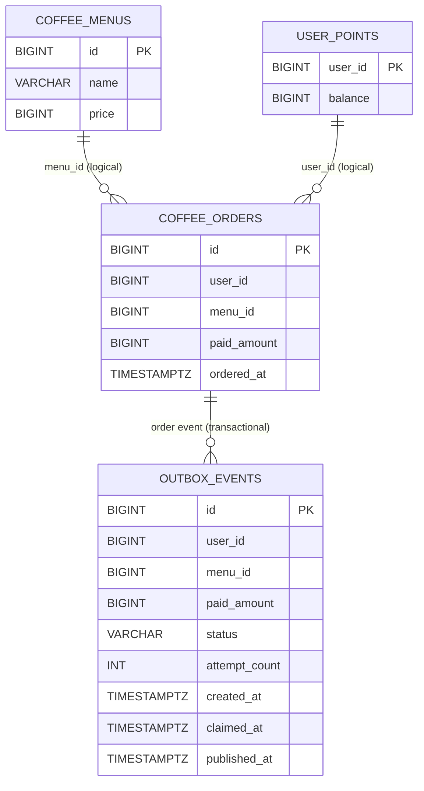

# ERD

## 테이블 설명

| 테이블 | 역할 | 주요 제약/인덱스 |
| --- | --- | --- |
| `coffee_menus` | 판매 메뉴 마스터 | `price > 0` |
| `user_points` | 사용자별 포인트 잔액 | `user_id` PK, `balance >= 0` |
| `coffee_orders` | 성공한 주문 이력 | `paid_amount > 0`, 주문 시각·메뉴/시각 인덱스 |
| `outbox_events` | 외부 주문 이벤트 발행 상태 | 상태·클레임 시각·ID 인덱스 |

현재 마이그레이션은 `coffee_orders`와 `outbox_events`에 물리적 외래 키를 선언하지 않습니다. 다이어그램의 관계는 애플리케이션이 보장하는 논리적 관계입니다.
