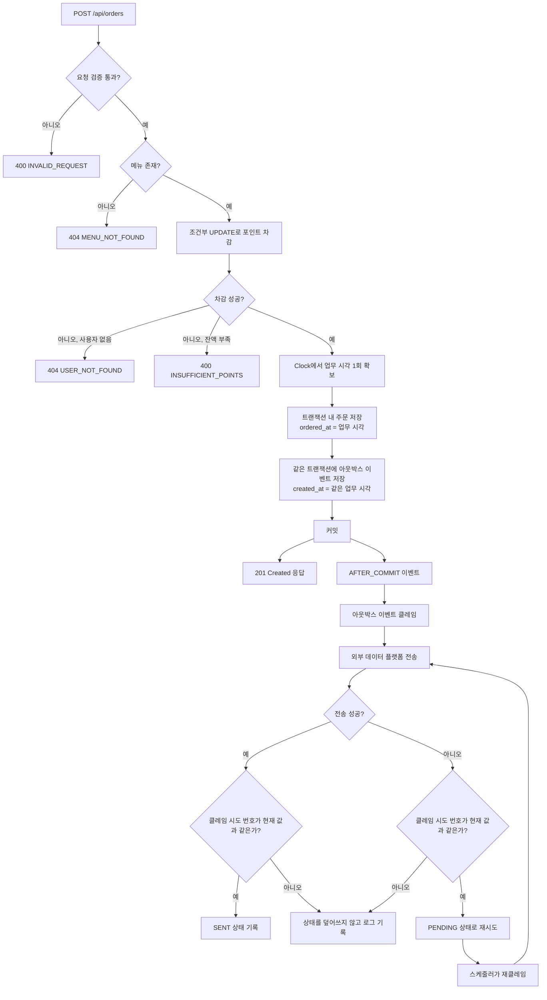

# 주문 처리 플로우

## 포인트 충전 동시성

1. 기존 포인트 행은 단일 `UPDATE`로 증가합니다.
2. 행이 없으면 새 행을 삽입합니다.
3. 첫 충전이 동시에 들어와 중복 키 오류가 발생하면, 실패한 트랜잭션을 종료하고 새 트랜잭션에서 기존 행 증가를 재시도합니다.

## 아웃박스 상태

| 상태 | 의미 |
| --- | --- |
| `PENDING` | 아직 전송하지 않았거나 재시도가 필요한 이벤트 |
| `PROCESSING` | 한 인스턴스가 전송 권한을 클레임한 이벤트 |
| `SENT` | 외부 전송 성공을 기록한 이벤트 |

클레임 시도 번호를 조건부 갱신에 함께 사용해, 만료된 이전 처리자가 현재 처리자의 상태를 덮어쓰지 못하도록 합니다.
